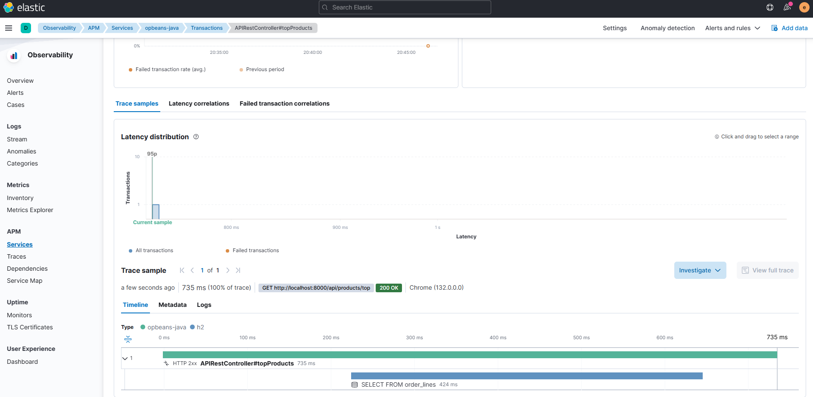

# Welcome



### 1. Introduction

The purpose of this repository is to build an Elastic test environment that uses **opbeans-java** as an example application, demonstrating how to integrate with Elastic APM. By following the steps below, you will set up and run the necessary components (Elasticsearch, Kibana, and APM Server) alongside the **opbeans-java** Java application.

---

### 2. Project structure

1. **all-in-one-compose**  
   
   - Contains a `docker-compose.yml` file that brings up the Elasticsearch stack (Elasticsearch, Kibana, APM Server, etc.) in an all-in-one setup.

2. **monitoring**  
   
   - Contains a `docker-compose.yml` file specifically for running the **opbeans-java** example application.

3. **helpers**  
   
   - A utility folder with various scripts that may assist in setup or other related tasks.

---

### 3. Install opbeans-java with Docker

#### Step 1: Clone the Repository

1. Make sure you have Git installed.  

2. Run the following command to clone the **opbeans-java** repository:
   
   ```bash
   git clone https://github.com/elastic/opbeans-java.git
   ```

3. Navigate into the cloned directory:
   
   ```bash
   cd opbeans-java
   ```

#### Step 2: Build the Docker Image

1. Ensure Docker is running on your machine.  

2. Build the **opbeans-java** image, tagging it as `opbeans/opbeans-java:latest`:
   
   ```bash
   docker build -t opbeans/opbeans-java:latest .
   ```

---

### 4. Compose Up All-in-One Compose

To set up the Elasticsearch stack (Elasticsearch, Kibana, APM Server, etc.):

1. Navigate to the `all-in-one-compose` folder in this project.  

2. Run:
   
   ```bash
   docker-compose up -d
   ```

This will start Elasticsearch, Kibana, and APM Server (among other services, if included).

---

### 5. Setup APM

Once the services are up, verify that the APM Server is reachable:

1. Open [http://localhost:8200](http://localhost:8200) in your browser.  

2. The JSON response should look similar to:
   
   ```json
   {
     "build_date": "2022-03-03T14:34:24Z",
     "build_sha": "7d34f3e579c7fadc5e70df76ed9b39332a40d0de",
     "publish_ready": true,
     "version": "8.1.0"
   }
   ```

#### If `"publish_ready": false`

1. Navigate to the `all-in-one-compose/apm_setup_docker` directory (or equivalent directory in your repository).  
2. Execute the `create_docker_compose.bat` file (on Windows) or the corresponding shell script (if available on other platforms).  
3. After running the script, confirm that `publish_ready` is now `true` by revisiting [http://localhost:8200](http://localhost:8200).

### Additional Kibana Configuration

To configure APM through Kibana:  

1. Open your browser and go to [http://localhost:5601](http://localhost:5601).  
2. Navigate to **Observability** and select **APM**.  
3. Follow the on-screen instructions to complete any additional setup (e.g., creating indices or configuring the APM Server).

---

### 6. Start **opbeans-java**

After the APM and Elasticsearch stack are ready, you can start the **opbeans-java** example application:

1. Navigate to the `monitoring` folder in this repository.  

2. In docker-compose.yml change the IP address with your local IP address (don't use localhost) 

3. Run:
   
   ```bash
   docker-compose up -d
   ```

4. The **opbeans-java** application should now be running and sending APM data to your Elasticsearch cluster.

---

### 7. Check Results in Observability

Finally, head back to **Kibana** at [http://localhost:5601](http://localhost:5601) and go to:

- **Observability** → **APM**

Here, you should see data coming from the **opbeans-java** Java application. You can explore transactions, service maps, errors, and other APM metrics to verify that the integration is functioning correctly.

---

**Congratulations!** You have successfully set up the Elastic test environment alongside **open-beans** and integrated it with Elastic APM. :rocket: